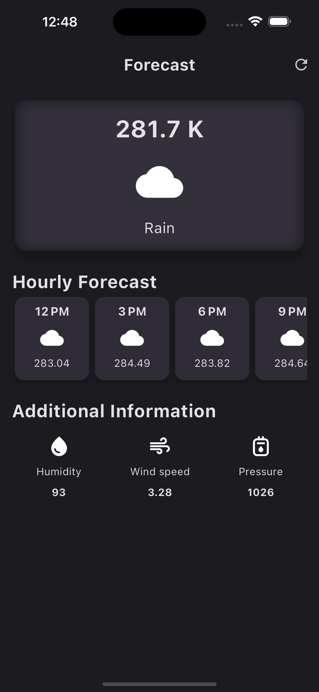

# Forecast_app

WeatherSnap Pro, a versatile Flutter app that effortlessly detects and delivers real-time weather updates for cities worldwide using the OpenWeather API. Accessible on both iOS and Android devices, as well as through a web application, provides comprehensive weather information, including temperature, pressure, humidity, and wind speed.

# Screenshot

